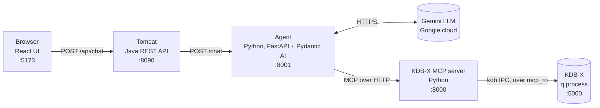
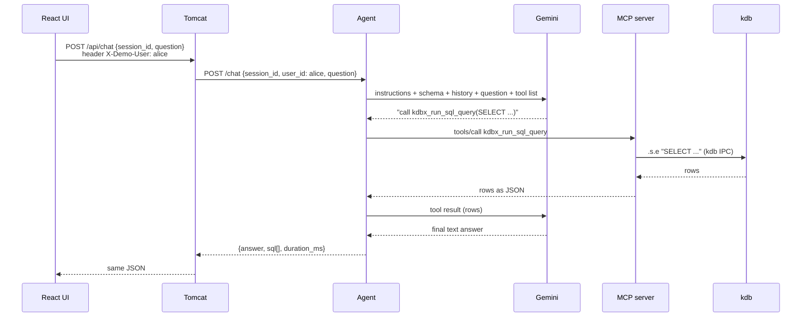

# 1. Architecture and infrastructure

## The big idea

A user asks a question in plain English. An **LLM** (Gemini) can't see the database, but it can ask for SQL queries to be run. The **agent** runs a loop: the LLM picks a query, the agent runs it against **kdb** (a time-series database) through the **MCP server**, sends the rows back to the LLM, and the LLM writes the answer.

> The LLM never computes numbers itself. kdb computes, and the LLM explains.

## The chain



| Component | What it is | Why it exists | Runs in |
|---|---|---|---|
| React UI (`frontend/`) | Chat page | User interface | Vite dev server on the host |
| Tomcat API (`backend/`) | Spring Boot WAR on Tomcat 10.1 | Mirrors a corporate app server. It owns user identity (Phase 2: real login) | Docker |
| Agent (`agent/kdb_agent.py`) | FastAPI app + Pydantic AI agent | Runs the LLM ↔ tool loop and keeps the chat history | Host |
| MCP server (`mcp-server/`) | KX's open-source server (git submodule, unmodified) | Gives any LLM agent a standard way to query kdb | Host |
| KDB-X (`kdb/`) | The q/kdb database with simulated prices | Stores and computes the data | Docker |

## One question, end to end



The LLM may call the tool several times before it answers. Each LLM call counts as one "request" against the Gemini quota.

## Ports and network

Every service listens on `127.0.0.1` only, so nothing is reachable from outside the laptop.

| Port | Service | Notes |
|---|---|---|
| 5173 | Vite | Proxies `/api/*` to Tomcat, so the browser talks to one origin |
| 8090 | Tomcat | Container port 8080, published on 8090 because 8080 is taken locally |
| 8001 | Agent | |
| 8000 | MCP server | Endpoint `http://127.0.0.1:8000/mcp` |
| 5000 | kdb | |

Two hops cross the Docker boundary:
- **MCP server (host) → kdb (container):** through the published port `127.0.0.1:5000`.
- **Tomcat (container) → agent (host):** through `host.docker.internal:8001`, Docker Desktop's name for "the host".

## Configuration and secrets

| File | Holds | Committed? |
|---|---|---|
| `~/qlic/kc.lic` | KDB-X licence | No (outside the repo) |
| `agent/.env` | `GOOGLE_API_KEY`, `AGENT_MODEL`, `MCP_URL` | No; `.env.example` is |
| `mcp-server/.env` | kdb host/port/user/password for the MCP server | No; created by `make kdb-user` |
| `kdb/users.txt` | `user:salt:sha1(salt+password)` | No; created by `make kdb-user` |

## Start order

Each service needs the one below it, so start from the bottom:

```bash
make kdb        # 1. database
make mcp        # 2. MCP server   (terminal 1)
make agent      # 3. agent        (terminal 2)
make backend    # 4. Tomcat
make frontend   # 5. UI           (terminal 3) → http://127.0.0.1:5173
make health     # checks the whole chain through Tomcat
```

## Security in one paragraph

kdb accepts only logged-in users, and the only user, `mcp_ro`, is read-only (see [02-kdb.md](02-kdb.md#7-how-this-project-secures-kdb)). That rule is enforced **in the database**, not in the LLM prompt, so a confused or manipulated LLM still can't change data. The prompt also tells the LLM to refuse writes, but that is a courtesy, not the protection.

## Where to read next

- [02-kdb.md](02-kdb.md): the database
- [03-agent.md](03-agent.md): how the agent and Pydantic AI work
- [04-mcp-server.md](04-mcp-server.md): MCP and the KX server
