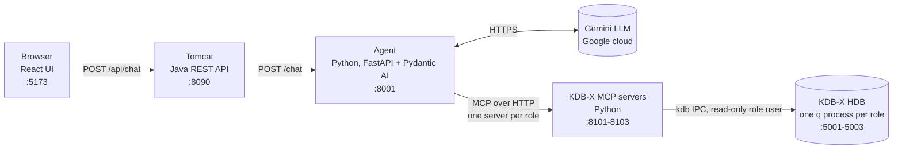
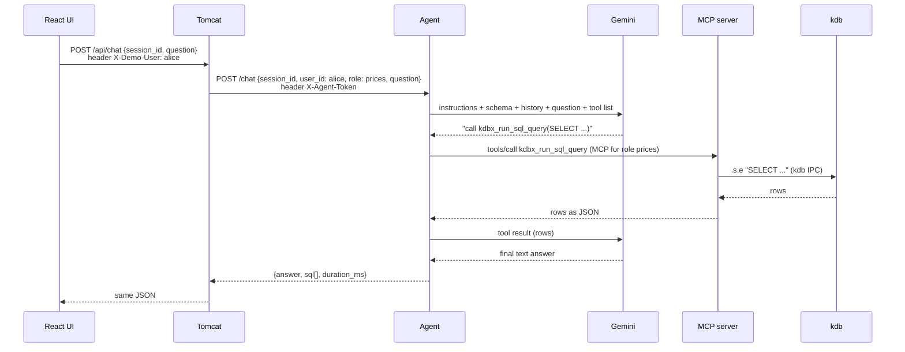

# 1. Architecture and infrastructure

## The big idea

A user asks a question in plain English. An **LLM** (Gemini) can't see the database, but it can ask for SQL queries to be run. The **agent** runs a loop: the LLM picks a query, the agent runs it against **kdb** (a time-series database) through the **MCP server**, sends the rows back to the LLM, and the LLM writes the answer.

> The LLM never computes numbers itself. kdb computes, and the LLM explains.

## The chain



Each user gets a **role** (alice → prices, bob → trades, carol → quotes). Each role has its own MCP server and its own q process, which can only see that role's table. See [06-roles.md](06-roles.md).

| Component | What it is | Why it exists | Runs in |
|---|---|---|---|
| React UI (`frontend/`) | Chat page | User interface | Vite dev server on the host |
| Tomcat API (`backend/`) | Spring Boot WAR on Tomcat 10.1 | Mirrors a corporate app server. It owns user identity and maps user → role (demo header for now; real login later) | Docker |
| Agent (`agent/kdb_agent.py`) | FastAPI app + Pydantic AI agent | Runs the LLM ↔ tool loop, keeps chat history, and routes each request to its role's MCP server | Host |
| MCP servers (`mcp-server/`) | KX's open-source server (git submodule, unmodified), one instance per role | Gives any LLM agent a standard way to query kdb | Host |
| KDB-X (`kdb/`) | One historical database (HDB) with `daily_prices`, `trades`, `quotes`; one q process per role that loads only that role's table | Stores and computes the data | Docker; each role's files are mounted read-only |

## One question, end to end



The LLM may call the tool several times before it answers. Each LLM call counts as one "request" against the Gemini quota.

## Ports and network

Every service listens on `127.0.0.1` only, so nothing is reachable from outside the laptop.

| Port | Service | Notes |
|---|---|---|
| 5173 | Vite | Proxies `/api/*` to Tomcat, so the browser talks to one origin |
| 8090 | Tomcat | Container port 8080, published on 8090 because 8080 is taken locally |
| 8001 | Agent | |
| 8101 / 8102 / 8103 | MCP servers (prices / trades / quotes) | Endpoint `http://127.0.0.1:<port>/mcp` |
| 5001 / 5002 / 5003 | kdb q processes `kdb-prices` / `kdb-trades` / `kdb-quotes` | Container port 5000 in each |

Two hops cross the Docker boundary:
- **MCP servers (host) → kdb (containers):** through the published ports `127.0.0.1:5001-5003`.
- **Tomcat (container) → agent (host):** through `host.docker.internal:8001`, Docker Desktop's name for "the host".

## Configuration and secrets

| File | Holds | Committed? |
|---|---|---|
| `~/qlic/kc.lic` | KDB-X licence | No (outside the repo) |
| `agent/.env` | `GOOGLE_API_KEY`, `AGENT_MODEL`, `MCP_URL_<ROLE>`, `AGENT_TOKEN` | No; `.env.example` is |
| `backend/.env` | `AGENT_TOKEN`, the same shared secret, so only Tomcat can call the agent | No; created by `make secrets` |
| `mcp-server/.env.<role>` | One per role: kdb port/user/password and MCP port | No; created by `make kdb-users` |
| `kdb/users.txt` | `ro_prices`, `ro_trades`, `ro_quotes`: `user:salt:sha1(salt+password)` | No; created by `make kdb-users` |
| `kdb/data/` | The HDB (`hdb/`) and the per-role views (`roles/`), about 73 MB | No; created by `make kdb-hdb` |

## Start order

Each service needs the one below it, so start from the bottom:

```bash
make secrets    # 0. once: shared agent token (agent/.env, backend/.env)
make kdb        # 1. three role q processes (first run: users + HDB)
make mcp        # 2. three MCP servers, in the background (logs: mcp-server/mcp-<role>.log)
make agent      # 3. agent        (terminal 1)
make backend    # 4. Tomcat
make frontend   # 5. UI           (terminal 2) → http://127.0.0.1:5173
make health     # checks every role through Tomcat
make test       # isolation + security tests, no LLM
```

## Security in one paragraph

Every rule is enforced **in kdb**, not in the LLM prompt. Each role's q process accepts only that role's read-only user, loads only that role's table, and has only that role's files mounted, read-only ([06-roles.md](06-roles.md), [02-kdb.md](02-kdb.md#8-how-this-project-secures-kdb)). So a confused or manipulated LLM can neither change data nor see another role's data. The prompt also tells the LLM to refuse writes, but that is a courtesy, not the protection.

## Where to read next

- [02-kdb.md](02-kdb.md): kdb, q, how to query it, security
- [03-kdb-storage.md](03-kdb-storage.md): HDB files on disk, memory-mapping, production RDB/HDB/gateway
- [04-agent.md](04-agent.md): how the agent and Pydantic AI work
- [05-mcp-server.md](05-mcp-server.md): MCP and the KX server
- [06-roles.md](06-roles.md): role-based read-only access (one q process + MCP server per role)
