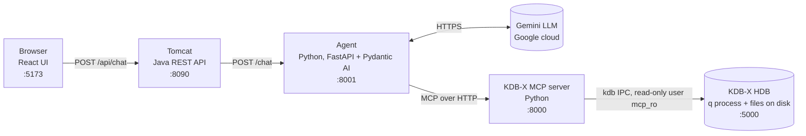
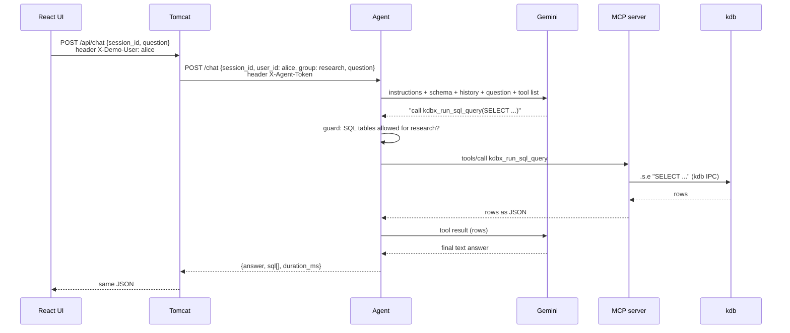

# 1. Architecture and infrastructure

## The big idea

A user asks a question in plain English. An **LLM** (Gemini) can't see the database, but it can ask for SQL queries to be run. The **agent** runs a loop: the LLM picks a query, the agent runs it against **kdb** (a time-series database) through the **MCP server**, sends the rows back to the LLM, and the LLM writes the answer.

> The LLM never computes numbers itself. kdb computes, and the LLM explains.

## The chain



Each user belongs to a **group** (alice → research, bob → trading, carol → all), and each group may query certain tables. The agent checks every SQL query against the user's group before it runs. See [06-access-control.md](06-access-control.md).

| Component | What it is | Why it exists | Runs in |
|---|---|---|---|
| React UI (`frontend/`) | Chat page | User interface | Vite dev server on the host |
| Tomcat API (`backend/`) | Spring Boot WAR on Tomcat 10.1 | Mirrors a corporate app server. It owns user identity and maps user → group (demo header for now; real login later) | Docker |
| Agent (`agent/kdb_agent.py`) | FastAPI app + Pydantic AI agent | Runs the LLM ↔ tool loop, keeps chat history, and enforces each group's table access | Host |
| MCP server (`mcp-server/`) | KX's open-source server (git submodule, unmodified) | Gives any LLM agent a standard way to query kdb | Host |
| KDB-X (`kdb/`) | q process serving a historical database (HDB) with `daily_prices`, `trades`, `quotes` | Stores and computes the data | Docker; the data in `kdb/data/hdb/` is mounted read-only |

## One question, end to end



The LLM may call the tool several times before it answers. Each LLM call counts as one "request" against the Gemini quota.

## Ports and network

Every service listens on `127.0.0.1` only, so nothing is reachable from outside the laptop.

| Port | Service | Notes |
|---|---|---|
| 5173 | Vite | Proxies `/api/*` to Tomcat, so the browser talks to one origin |
| 8090 | Tomcat | Container port 8080, published on 8090 because 8080 is taken locally |
| 8001 | Agent | |
| 8000 | MCP server | Endpoint `http://127.0.0.1:8000/mcp` |
| 5000 | kdb (container `kdbx`) | |

Two hops cross the Docker boundary:
- **MCP server (host) → kdb (container):** through the published port `127.0.0.1:5000`.
- **Tomcat (container) → agent (host):** through `host.docker.internal:8001`, Docker Desktop's name for "the host".

## Configuration and secrets

| File | Holds | Committed? |
|---|---|---|
| `~/qlic/kc.lic` | KDB-X licence | No (outside the repo) |
| `agent/.env` | `GOOGLE_API_KEY`, `AGENT_MODEL`, `MCP_URL`, `AGENT_TOKEN` | No; `.env.example` is |
| `agent/groups.yaml` | User group → tables it may query | Yes (config, not a secret) |
| `agent/logs/queries.jsonl` | Every SQL tool call, allowed or blocked | No |
| `backend/.env` | `AGENT_TOKEN`, the same shared secret, so only Tomcat can call the agent | No; created by `make secrets` |
| `mcp-server/.env` | kdb host/port/user/password for the MCP server | No; created by `make kdb-user` |
| `kdb/users.txt` | `mcp_ro:salt:sha1(salt+password)` | No; created by `make kdb-user` |
| `kdb/data/hdb/` | The database files, about 73 MB | No; created by `make kdb-hdb` |

## Start order

Each service needs the one below it, so start from the bottom:

```bash
make secrets    # 0. once: shared agent token (agent/.env, backend/.env)
make kdb        # 1. database (first run: user + HDB files)
make mcp        # 2. MCP server, in the background (log: mcp-server/mcp.log)
make agent      # 3. agent        (terminal 1)
make backend    # 4. Tomcat
make frontend   # 5. UI           (terminal 2) → http://127.0.0.1:5173
make health     # checks the whole chain through Tomcat
make test       # isolation + security tests, no LLM
```

## Security in one paragraph

Nothing relies on the LLM behaving. **kdb** makes everything read-only: one read-only login, and a read-only mount ([02-kdb.md](02-kdb.md#8-how-this-project-secures-kdb)). The **agent's guard** parses every SQL query and blocks tables outside the user's group ([06-access-control.md](06-access-control.md)). So a confused or manipulated LLM can neither change data nor read another group's tables. The prompt also tells the LLM to refuse writes, but that is a courtesy, not the protection.

## Where to read next

- [02-kdb.md](02-kdb.md): kdb, q, how to query it, security
- [03-kdb-storage.md](03-kdb-storage.md): HDB files on disk, memory-mapping, production RDB/HDB/gateway
- [04-agent.md](04-agent.md): how the agent and Pydantic AI work
- [05-mcp-server.md](05-mcp-server.md): MCP and the KX server
- [06-access-control.md](06-access-control.md): user groups, the SQL allowlist and the query log
