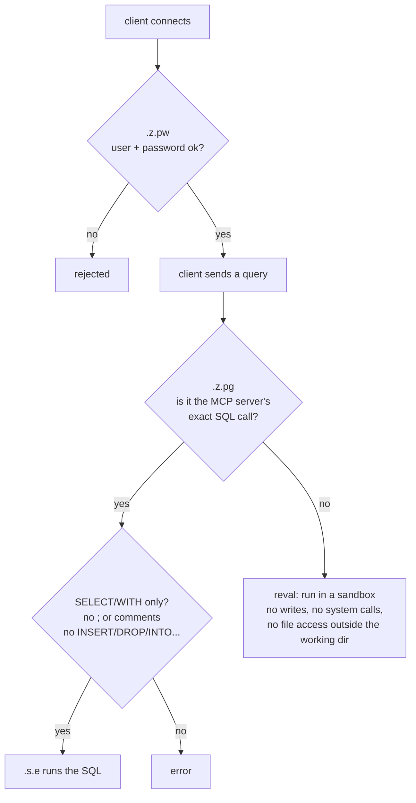

# 2. kdb: the database

## 1. The big idea

**kdb+** (the new version is **KDB-X**) is a very fast **column-oriented, in-memory** database, built for time series such as market data. Its programming language is **q**.

Think of it as Python + pandas + a database server in one small process:

| Python world | kdb world |
|---|---|
| Python interpreter | `q` process |
| pandas DataFrame | q **table** |
| a variable holding a DataFrame | a **global variable** holding a table (`daily_prices`) |
| pandas code | q code (`select avg close by sym from daily_prices`) |
| Postgres server on a port | the same q process listening on a port (`\p 5000`) |

The point to remember: **in kdb, the database is a running q process, and tables are just variables in it.** There's no separate storage engine; this project's data exists only in memory and is regenerated at startup. (Large deployments also save tables to disk, but that's not used here.)

## 2. Our data

`kdb/gen_data.q` creates one table at startup with a fixed random seed, so the data is identical every time:

```
daily_prices: 26,100 rows = 100 tickers × 261 weekdays (2025-10-01 … 2026-09-30)

date        sym   name             close   volume
2025.10.01  T001  Acme Analytics   389.36  1585187
2025.10.01  T002  Acme Biotech     355.44  4038108
...
```

The prices are a simulated random walk, and the tickers and names are made up.

## 3. Two languages: q and SQL

kdb's native language is **q**. KX also ships a **SQL** layer (`.s.e`) that translates SQL into q. The MCP server uses SQL, because LLMs write SQL well.

| Task | q | SQL (via `.s.e`) |
|---|---|---|
| All rows for T001 | `select from daily_prices where sym=`T001` | `SELECT * FROM daily_prices WHERE "sym"='T001'` |
| Average close per ticker | `select avg close by sym from daily_prices` | `SELECT "sym", avg("close") FROM daily_prices GROUP BY "sym"` |
| Row count | `count daily_prices` | `SELECT count(*) FROM daily_prices` |

q quick-read guide:
- `` `T001 `` is a **symbol** (an interned string, like a pandas category).
- Dates look like `2026.06.15`.
- `x:5` means assignment, so `=` is comparison.
- q evaluates **right to left**: `2*3+4` is `14`.
- `/` starts a comment.

KX SQL gotchas, learned in this project:
- **Always double-quote column names**: `SELECT "sym", max("close") ...`. Unquoted `sym` can fail to parse.
- No window functions (`LAG`, `OVER`), no `abs()`, no correlated subqueries in `SELECT`, and no `<`/`>` conditions inside `JOIN ... ON`.

## 4. Getting a q prompt

The server runs inside the `kdbx` container. **Don't attach to the server's own console**; start a second q process instead. There are two kinds of session:

### a) Scratch session: full access to a private copy of the data

```bash
docker exec -it kdbx q /opt/app/gen_data.q     # new q process; loads the same data
```

You get full q (no restrictions) on your own copy of the data. Nothing you do affects the server. This is the best place to learn q.

### b) Client session: query the real server as `mcp_ro`

```bash
docker exec -it --env-file mcp-server/.env kdbx q
```

Then inside q:

```q
h:hopen `$"::5000:mcp_ro:",getenv`KDBX_DB_PASSWORD   / open a connection handle
h"count daily_prices"                               / send q code as a string, get the result back
h"select from daily_prices where sym=`T001, date=2026.06.15"
h"delete from `daily_prices"                         / → 'noupdate  (read-only)
hclose h
```

`h` is a **connection handle** (an integer). Calling it with a string runs that string on the server, which is how all kdb clients work, including the MCP server.

To quit q, type `\\` and press Enter.

## 5. Everyday commands

Run these in either session (prefix them with `h` in a client session):

| Want to… | Command | Notes |
|---|---|---|
| List tables | `tables[]` | → `` ,`daily_prices `` |
| Show the schema | `meta daily_prices` | Columns: `c` name, `t` type (`d` date, `s` symbol, `f` float, `j` long), `a` attribute (`s` = sorted) |
| Count rows | `count daily_prices` | |
| First rows | `5#daily_prices` | `#` = take |
| Filter | `select from daily_prices where sym=`T001, date within 2026.01.01 2026.03.31` | |
| Aggregate | `select avg close, max volume by sym from daily_prices` | `by` = GROUP BY |
| Run SQL | `.s.e "SELECT \"sym\", avg(\"close\") FROM daily_prices GROUP BY \"sym\""` | In a scratch session, run `.s.init[]` first |
| List variables | `\a` (tables) or `\v` (all variables) | |
| List namespaces | `key ` `` | `.s` = SQL, `.z` = system hooks, `.sec` = our security code |

**"List databases?"** kdb has no `SHOW DATABASES`. One q process is one database, and its tables are its global variables, so `tables[]` is the whole answer. To see what's running, list processes and ports (`docker ps`, port 5000).

Two shortcuts:

```bash
make kdb-expected     # runs kdb/expected.q: test answers computed in q
make kdb-test         # security test suite
docker logs kdbx      # audit log: every remote query with user and time
```

## 6. pykx: q from Python

**pykx** is KX's Python library. It has two modes:
- **IPC client** (what we use): connect to a q server and send queries, like `psycopg` for Postgres.
- **Embedded q:** run q inside the Python process. This needs the licence (`QLIC`).

The MCP server uses pykx as an IPC client. To try it from the host, using the MCP server's virtualenv:

```bash
set -a; . mcp-server/.env; set +a
QLIC=~/qlic mcp-server/.venv/bin/python
```

```python
import os, pykx as kx

conn = kx.SyncQConnection(host="127.0.0.1", port=5000,
                          username="mcp_ro", password=os.environ["KDBX_DB_PASSWORD"])

conn("tables[]")                                    # → pykx SymbolVector
df = conn("select from daily_prices where sym=`T001").pd()   # .pd() → pandas DataFrame

# pass Python values as arguments (safer than building strings)
conn("{select avg close by sym from daily_prices where sym in x}",
     kx.SymbolVector(["T001", "T002"])).pd()

conn("delete from `daily_prices")                   # raises: noupdate (read-only)
```

What comes back is a pykx object that wraps q data. Call `.pd()` for pandas or `.py()` for plain Python.

## 7. How this project secures kdb

All the code is in `kdb/init.q`. q lets you override **callback hooks** that run on every connection or query:



| Hook | Our override |
|---|---|
| `.z.pw[user;password]` | Checks the user against `users.txt` (salted SHA-1). Anonymous and unknown users are rejected. The file is re-read on each login. |
| `.z.pg[query]` (sync query) | Logs the query. The MCP server's SQL call goes through a read-only SQL check. Everything else runs under `reval`, q's built-in read-only sandbox. |
| `.z.ps` (async query) | Same, always under `reval`. |
| `.z.ph`, `.z.pp`, `.z.ws` | HTTP and websocket access are disabled. |

Why the SQL path is special: KX's `.s.e` writes an internal counter, so it can't run inside `reval`. It runs unrestricted instead, but only after the SQL text passes `.sec.readOnly`: a single `SELECT`/`WITH` statement with no write keywords outside quoted strings.

Two safety nets:
- **Fail closed:** the port opens on the last line of `init.q` (`\p 5000`). If anything above it fails, nothing is exposed.
- **Resource limits:** the startup flags `-T 30` (cancel queries after 30s) and `-w 2000` (2 GB memory cap; q aborts and Docker restarts it).

## 8. Files

| File | Purpose |
|---|---|
| `kdb/Dockerfile` | Debian + q binary + SQL module (`s.k_`). The licence is mounted at runtime, not baked into the image |
| `kdb/docker-compose.yml` | Port, licence and credentials mounts, startup command |
| `kdb/gen_data.q` | Builds `daily_prices` |
| `kdb/init.q` | Loads data, enables SQL, installs security, opens the port |
| `kdb/mkuser.sh` | Creates or rotates the `mcp_ro` password (`make kdb-user`) |
| `kdb/test_security.q` | Auth and read-only tests (`make kdb-test`) |
| `kdb/expected.q` | Reference answers for the end-to-end tests |
