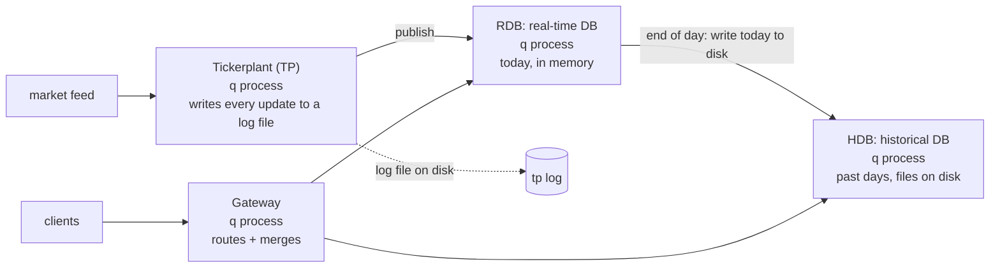

# 3. kdb storage and production architecture

How kdb keeps data on disk, how q reads it, and how production setups combine processes. Basics are in [02-kdb.md](02-kdb.md).

## 1. The big picture: today in memory, history on disk

Production kdb usually splits data by age:



| Process | Holds | Storage |
|---|---|---|
| **Tickerplant (TP)** | Nothing it queries. It receives updates, **logs them to disk**, then forwards them | Log file |
| **RDB** (real-time database) | Today's data | Memory |
| **HDB** (historical database) | All past days | Files, one folder per date |
| **Gateway** | Nothing. It's the single entry point for clients | — |

Each of these is just a q process running a different script:
- TP: q + `tick.q`
- RDB: q + `r.q`
- HDB: q + `\l /hdb`
- gateway: q + routing code

**End of day (EOD):** the RDB writes today's data into a new HDB date folder, tells the HDB to reload, and clears its memory.

**This project runs only the HDB** (one year, 2025-10-01 to 2026-09-30). See [section 6](#6-adding-an-rdb-later) for adding the rest.

## 2. If data is in memory, what happens on a crash?

Nothing is lost:
- **The TP writes every update to its log on disk before** sending it to the RDB.
- If the **RDB crashes**, it restarts and **replays today's log** to rebuild its memory.
- If the **TP crashes**, its log is still on disk up to the last write.
- **Redundancy:** production runs duplicate TP/RDB pairs, often on different machines fed by the same source, with failover.
- **History** is files on replicated or backed-up storage.

So "in memory" means fast queries, and the log is what makes the data durable.

## 3. What a gateway does

Clients connect to the gateway instead of the RDB or HDB. The gateway:
- **routes**: today's data from the RDB, past days from the HDB, both merged when a query spans them;
- **balances load** across copies, for example several HDB processes;
- **enforces** login and permissions in one place.

Clients see one endpoint and don't need to know where the data lives.

## 4. What an HDB looks like on disk

**A database is a directory, and a table is a folder of column files.** Our HDB (`kdb/data/hdb/`, about 73 MB, three tables):

```
kdb/data/hdb/                  ← the database: what `\l` loads
├── sym                        ← symbol list for the whole database: `T001`T002…`Acme Analytics…
├── 2025.10.01/                ← one folder per date (a "partition")
│   ├── daily_prices/          ← a table = a folder        (100 rows: 1 per ticker)
│   │   ├── .d                 ← column order: `sym`name`close`volume
│   │   ├── sym                ← one file per column (integer indexes into /hdb/sym)
│   │   ├── name
│   │   ├── close              ← a binary array of 100 floats
│   │   └── volume
│   ├── trades/                ← .d sym time price size        (2,000 rows: 20 per ticker)
│   └── quotes/                ← .d sym time bid ask bsize asize (4,000 rows: 40 per ticker)
├── 2025.10.02/ …
└── … 261 date folders
```

Key points:
- **There's no `date` file.** The date comes from the folder name, and q adds it as a virtual column.
- **Each column is a flat binary array**, so reading one column means reading one file.
- **Symbols are stored once**, in the root `sym` file. Column files store small integers that point into it (called *enumeration*, like a pandas category).
- **Within a day, rows are sorted by `sym`**, and `sym` carries the `p` (parted) attribute, so finding one ticker's rows is a quick lookup. `meta daily_prices` shows `a=p`.
- Small reference tables (for example ticker master data) usually sit at the root as one folder, not split by date.

## 5. How a query reads the files: memory-mapping

q doesn't load the whole database into memory, and it doesn't re-read files on every query:

1. `\l /hdb` at startup only **scans the folder structure**: which dates exist and which tables and columns.
2. On a query, q:
   - **prunes by date**: it opens only the date folders the `where date…` clause matches;
   - **reads only the columns the query uses**;
   - **memory-maps** those files (`mmap`): the OS makes the file look like an array in memory and loads only the pages that are touched.
3. The OS **page cache** keeps hot pages in RAM, so repeated queries are served from memory.

```
select avg close by sym from daily_prices where date within 2026.01.01 2026.03.31
→ ~63 date folders × 2 column files (sym, close) → mmap → compute → result
```

That's why **you should always filter on `date` first**. Without it, q touches every partition.

## 6. Seeing and reading the files yourself

The HDB is a normal folder on your Mac (`kdb/data/hdb/`, git-ignored):

```bash
ls kdb/data/hdb | head                                # date folders + the sym file
ls -la kdb/data/hdb/2026.09.29/trades                 # .d sym time price size
du -sh kdb/data/hdb                                   # size
xxd kdb/data/hdb/2026.09.29/daily_prices/close | head # raw bytes: header + 8-byte floats
```

The files are **binary**, so read them with q. In the admin session (`make kdb-admin`, which mounts the HDB at `/hdb`):

```q
get `:/hdb/2026.09.29/daily_prices/.d       / → `sym`name`close`volume
get `:/hdb/2026.09.29/daily_prices/close    / → 100 floats
get `:/hdb/sym                              / → `T001`T002…`Acme Analytics…
get `:/hdb/2026.09.29/daily_prices          / → that day's table
date                                        / → all partition dates
```

`` `:path `` is q's syntax for a file handle, and `get` reads a file back as a q value.

## 7. How this project builds and serves the HDB

```mermaid
flowchart LR
    G[gen_data.q<br/>3 tables in memory] --> B["build_hdb.q<br/>(hdb-builder container,<br/>writes ./data)"]
    B --> D[(data/hdb/<br/>date folders)]
    D -->|mounted read-only| S["kdbx server<br/>init.q: \l /db"
```

- `make kdb-hdb` runs the one-off `hdb-builder` container, which runs `build_hdb.q`. For each table and date, `.Q.dpft[db;date;`sym;`table]` writes the partition: it enumerates symbols against `/hdb/sym`, sorts by `sym`, and applies `p#`.
- `make kdb` builds the HDB first if `kdb/data/hdb` doesn't exist.
- The server mounts the HDB **read-only**. Only the builder can write, the way a production EOD process is the only writer.
- To rebuild: `rm -rf kdb/data && make kdb-hdb && make kdb`.

## 8. Adding an RDB later

The HDB stays as it is. You'd add:
1. A **TP + RDB** (plus a small feed script) with the same table columns, holding today's data.
2. A **gateway** process. Then point the MCP server at it: `KDBX_DB_PORT` in `mcp-server/.env`.
3. An **EOD** step: write today with `.Q.dpft` into `data/hdb`, then reload the HDB (`\l /db`).

Table access per user group doesn't change: the agent's check works on table names, wherever the data lives.
4. The same security for every process. Move the security part of `init.q` into a shared `sec.q`.

The hard part is the gateway: SQL that covers both today and history has to be split and merged.
