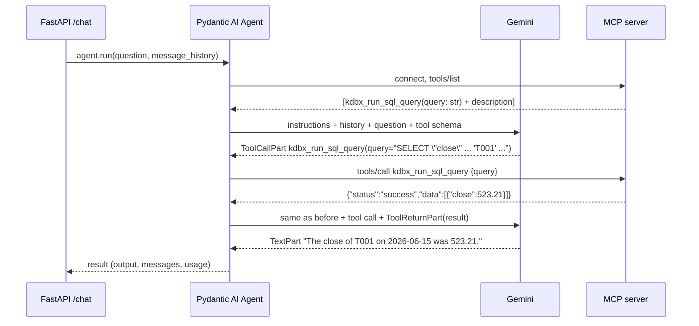

# 3. The agent: Pydantic AI + MCP

Code: `agent/kdb_agent.py` (about 150 lines).

## 1. The big idea: an LLM plus tools plus a loop

An LLM on its own only turns text into text. It can't see the database. An **agent** gives it **tools** and runs a loop:

```
while True:
    reply = llm(instructions, history, tool_descriptions)
    if reply is a tool call:              # "please run kdbx_run_sql_query(query=...)"
        result = run_the_tool(reply)      # our code runs it, not the LLM
        history += [reply, result]
    else:                                 # plain text: the final answer
        return reply
```

Three points:
1. **The LLM never runs anything.** It returns a structured request ("call tool X with arguments Y"), and our code runs it.
2. **The LLM knows a tool only from its description.** Before each call it receives each tool's name, its description, and a JSON schema for the arguments. It chooses tools based on that text.
3. **Memory is just the message list.** Each LLM call is stateless. A "conversation" means sending the earlier messages again every time.

**Pydantic AI** is a Python library that implements this loop: it talks to many LLM providers, describes tools to them, runs the tools and keeps the history. **MCP** ([doc 05](05-mcp-server.md)) is where our tools come from.

## 2. One question, step by step

Question: *"What was the close of T001 on 2026-06-15?"*



That's **2 LLM requests** for one question. Harder questions may need more, for example when a query fails, the LLM reads the error and tries again.

The message list after this run (simplified):

```
ModelRequest   (instructions="You answer questions…") [UserPromptPart("What was the close…")]
ModelResponse  [ToolCallPart(tool_name="kdbx_run_sql_query", args={"query": "SELECT …"})]
ModelRequest   [ToolReturnPart(content={"status":"success","data":[…]})]
ModelResponse  [TextPart("The close of T001 on 2026-06-15 was 523.21.")]
```

`ModelRequest` = what we sent; `ModelResponse` = what the LLM returned. A follow-up such as *"and T002?"* is sent with this whole list as history, and that's how the LLM knows "and T002" means "close on 2026-06-15".

## 3. Pydantic AI concepts used

| Concept | In our code | Meaning |
|---|---|---|
| `Agent(model, ...)` | `Agent(AGENT_MODEL, deps_type=str, instructions=INSTRUCTIONS)` | The loop plus its configuration |
| Model string | `"google:gemini-3.1-flash-lite"` | `provider:model`. Switch to `"anthropic:claude-haiku-4-5"` and nothing else changes |
| Instructions | `INSTRUCTIONS` + `@agent.instructions def db_context(ctx)` | System-prompt text sent on every call. A decorated function is evaluated on each run, so its text can depend on the request |
| Deps | `deps=req.role` → `ctx.deps` | A value you pass into a run, readable by instruction functions and tools. Ours is the caller's role |
| Toolset | `MCPToolset(url)` per role | A group of tools. `MCPToolset` gets its tools from an MCP server |
| Per-run toolsets | `agent.run(..., toolsets=[toolsets[role]])` | Tools available for **this run only**. Our code chooses them; the LLM can't |
| `agent.run(prompt, message_history=...)` | `/chat` | Runs the whole loop; returns `AgentRunResult` |
| `result.output` | answer text | The final `TextPart` |
| `result.all_messages()` / `new_messages()` | history / this turn only | Lists of `ModelRequest`/`ModelResponse` |
| `result.usage` | token log | `input_tokens`, `output_tokens`, `requests` |

## 4. The code, top to bottom

### Setup and config

```python
load_dotenv()                                    # read agent/.env into os.environ
AGENT_MODEL = os.getenv("AGENT_MODEL", "google:gemini-3.5-flash")
ROLE_MCP_URLS = {"prices": "http://127.0.0.1:8101/mcp",    # one MCP server per role
                 "trades": "http://127.0.0.1:8102/mcp",    # (overridable: MCP_URL_<ROLE>)
                 "quotes": "http://127.0.0.1:8103/mcp"}
AGENT_TOKEN = os.getenv("AGENT_TOKEN", "")       # shared secret: only Tomcat may call /chat
```

`load_dotenv()` runs before the Pydantic AI imports, so `GOOGLE_API_KEY` is already set when the Google provider reads it.

### Instructions

`INSTRUCTIONS` holds the rules (always query, never calculate by hand, say when there's no data, say when data isn't in your tables, refuse writes) plus **SQL dialect notes**. The notes exist because KX SQL lacks features the LLM would otherwise reach for, such as `LAG()`. This is plain prompt engineering: text that steers the model. Every SQL pattern in it was tested against kdb.

`FALLBACK_SCHEMA` is a hand-written description per role, used only if that role's MCP resources can't be read at startup.

### The agent, the toolsets, and per-role context

```python
toolsets = {role: MCPToolset(url) for role, url in ROLE_MCP_URLS.items()}
agent = Agent(AGENT_MODEL, deps_type=str, instructions=INSTRUCTIONS)   # no tools attached here
contexts = dict(FALLBACK_SCHEMA)                       # role → schema + SQL guidance text
sessions: dict[tuple[str, str], list[ModelMessage]] = {}   # (role, session_id) → history

@agent.instructions
def db_context(ctx: RunContext[str]) -> str:
    return contexts[ctx.deps]                          # ctx.deps = this run's role
```

- **No tool is written in this file.** `MCPToolset` asks its MCP server which tools exist and turns each one into a Pydantic AI tool automatically.
- **No tools are attached to the agent.** Each run is given exactly one toolset, its role's, so the LLM can't even see another role's tools.
- **History is keyed by role**, so data one role saw never ends up in another role's prompt.

### Startup: load each role's schema and SQL guidance

```python
async def load_mcp_context(role):
    for res in await toolsets[role].list_resources():     # MCP "resources" = read-only documents
        if res.name in ("kdbx_describe_tables", "kdbx_sql_query_guidance"):
            ...read it...
    contexts[role] = "\n\n".join(parts)                    # becomes that role's instructions

@asynccontextmanager
async def lifespan(_):                                     # FastAPI runs this once at startup
    if not AGENT_TOKEN: raise RuntimeError(...)            # fail closed: no token, no service
    for role, toolset in toolsets.items():
        async with toolset:                                # open an MCP connection just for this
            await load_mcp_context(role)
    yield                                                  # app serves requests from here on
```

MCP servers offer **tools** (actions the LLM can call) and **resources** (documents). For each role we read two resources once and put them in that role's prompt: its table schema with sample rows (only its own table) and KX's SQL guide.

### The chat endpoint

```python
@app.post("/chat")
async def chat(req: ChatRequest, x_agent_token: str = Header(default="")):
    if not secrets.compare_digest(x_agent_token, AGENT_TOKEN):   # only Tomcat knows the token
        raise HTTPException(401, ...)
    if req.role not in toolsets:
        raise HTTPException(403, ...)
    key = (req.role, req.session_id)
    for delay in (*RETRY_DELAYS, None):                  # (5, 10, None) → up to 3 attempts
        try:
            result = await agent.run(req.question, message_history=sessions.get(key),
                                     deps=req.role, toolsets=[toolsets[req.role]])
            break
        except ModelHTTPError as e:                      # Gemini returned an HTTP error
            if e.status_code not in (429, 503) or "PerDay" in str(e.body) or delay is None:
                raise HTTPException(502, ...)            # not retryable → 502 to Tomcat
            await asyncio.sleep(delay)                   # rate limit / overload → wait, retry
    sessions[key] = result.all_messages()                # save history for the next turn
    sql = sql_from(result.new_messages())                # SQL actually run this turn
    log.info(json.dumps({...role, tokens, sql...}))      # one structured log line per request
    return ChatResponse(answer=result.output, sql=sql, ...)
```

- **`agent.run(...)` is the whole loop from section 1.** It connects to the role's MCP server, calls Gemini, runs tools and repeats, then returns. Each run opens and closes its own MCP connection, so the agent keeps working if an MCP server restarts.
- **The role comes from Tomcat, not from the question.** The LLM has no way to change it.
- **Retries:** 429 (rate limit) and 503 (overloaded) are temporary, so we retry twice. A daily quota doesn't reset in seconds, so we don't retry it. The total wait stays well under Tomcat's 90s timeout.
- **History** lives in a Python dict, so it's lost on restart. That's fine for a demo.

### Getting the SQL that was run

```python
def sql_from(messages):
    return [part.args_as_dict().get("query", "")
            for m in messages if isinstance(m, ModelResponse)
            for part in m.parts
            if isinstance(part, ToolCallPart) and part.tool_name == "kdbx_run_sql_query"]
```

The SQL comes from the **tool-call records**, not from the answer text. That's what was really sent to kdb, and it's what the UI shows under "Show SQL".

### Health

`/health` reads the `kdbx://tables` resource through **each** role's MCP server. This goes all the way to each kdb process, and reports per role.

## 5. Who controls what

| Concern | Controlled by |
|---|---|
| Which SQL to write | The LLM, guided by the instructions, schema and guidance |
| Running the SQL | The role's MCP server → the role's kdb process (the LLM only *asks*) |
| What SQL is allowed, and which tables exist | kdb (`init.q` + what each role's process loaded): enforced in the database |
| Which role a request runs as | Tomcat (user → role), passed to the agent, never chosen by the LLM |
| The numbers in the answer | kdb results. The LLM is told to copy them, not compute them |
| Conversation memory | Our `sessions` dict, keyed by (role, session) |
| Which LLM | `AGENT_MODEL` in `agent/.env` |

## 6. Try it

```bash
curl -s 127.0.0.1:8001/health
T=$(grep ^AGENT_TOKEN agent/.env | cut -d= -f2)          # pretend to be Tomcat
curl -s 127.0.0.1:8001/chat -H 'content-type: application/json' -H "X-Agent-Token: $T" \
  -d '{"session_id":"s1","user_id":"me","role":"prices","question":"What was the close of T001 on 2026-06-15?"}'
curl -s 127.0.0.1:8001/chat -H 'content-type: application/json' -H "X-Agent-Token: $T" \
  -d '{"session_id":"s1","user_id":"me","role":"prices","question":"and T002?"}'   # same session → uses history
curl -s 127.0.0.1:8001/chat -H 'content-type: application/json' \
  -d '{"session_id":"s1","user_id":"me","role":"prices","question":"hi"}'          # no token → 401
```

Normally you go through Tomcat instead: `curl -s 127.0.0.1:8090/api/chat -H 'X-Demo-User: bob' ...`.

The agent log line for each request shows the SQL, the token counts and the number of LLM requests.

Tests:
- `make test` runs `agent/tests/test_roles.py`: role isolation through each MCP server, plus the agent and Tomcat guards. No LLM is involved.
- `make test-llm` runs `agent/tests/test_e2e.py`: the plan's questions, plus trades and quotes questions, compared with `make kdb-expected`. These call the real LLM, so mind the free-tier quota (about 20 requests per day per model).
