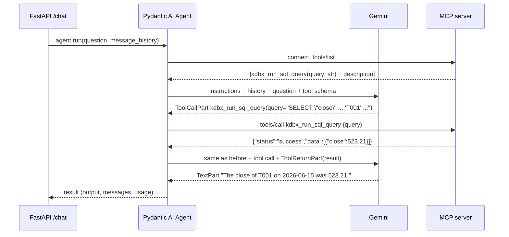

# 4. The agent: Pydantic AI + MCP

Code: `agent/kdb_agent.py` (about 220 lines) and `agent/access.py` (the table check).

## 1. The big idea: an LLM plus tools plus a loop

An LLM on its own only turns text into text. It can't see the database. An **agent** gives it **tools** and runs a loop:

```
while True:
    reply = llm(instructions, history, tool_descriptions)
    if reply is a tool call:              # "please run kdbx_run_sql_query(query=...)"
        result = run_the_tool(reply)      # our code runs it, not the LLM
        history += [reply, result]
    else:                                 # plain text: the final answer
        return reply
```

Three points:
1. **The LLM never runs anything.** It returns a structured request ("call tool X with arguments Y"), and our code runs it.
2. **The LLM knows a tool only from its description.** Before each call it receives each tool's name, its description, and a JSON schema for the arguments. It chooses tools based on that text.
3. **Memory is just the message list.** Each LLM call is stateless. A "conversation" means sending the earlier messages again every time.

**Pydantic AI** is a Python library that implements this loop: it talks to many LLM providers, describes tools to them, runs the tools and keeps the history. **MCP** ([doc 05](05-mcp-server.md)) is where our tools come from.

## 2. One question, step by step

Question: *"What was the close of T001 on 2026-06-15?"*



That's **2 LLM requests** for one question. Harder questions may need more, for example when a query fails, the LLM reads the error and tries again.

The message list after this run (simplified):

```
ModelRequest   (instructions="You answer questions…") [UserPromptPart("What was the close…")]
ModelResponse  [ToolCallPart(tool_name="kdbx_run_sql_query", args={"query": "SELECT …"})]
ModelRequest   [ToolReturnPart(content={"status":"success","data":[…]})]
ModelResponse  [TextPart("The close of T001 on 2026-06-15 was 523.21.")]
```

`ModelRequest` = what we sent; `ModelResponse` = what the LLM returned. A follow-up such as *"and T002?"* is sent with this whole list as history, and that's how the LLM knows "and T002" means "close on 2026-06-15".

## 3. Pydantic AI concepts used

| Concept | In our code | Meaning |
|---|---|---|
| `Agent(model, ...)` | `Agent(AGENT_MODEL, deps_type=Caller, toolsets=[toolset], instructions=INSTRUCTIONS)` | The loop plus its configuration |
| Model string | `"google:gemini-3.5-flash"` (set `AGENT_MODEL` in `agent/.env`) | `provider:model`. Switch to `"anthropic:claude-haiku-4-5"` and nothing else changes |
| Instructions | `INSTRUCTIONS` + `@agent.instructions def db_context(ctx)` | System-prompt text sent on every call. A decorated function is evaluated on each run, so its text can depend on the caller |
| Deps | `deps=Caller(user, group, session)` → `ctx.deps` | A value our code passes into a run, readable by instruction functions and tool hooks. The LLM can't change it |
| Toolset | `MCPToolset(MCP_URL, process_tool_call=guard)` | A group of tools fetched from an MCP server. `process_tool_call` is a hook that runs **before every tool call** |
| `agent.run(prompt, message_history=..., deps=...)` | `/chat` | Runs the whole loop; returns `AgentRunResult` |
| `result.output` | answer text | The final `TextPart` |
| `result.all_messages()` / `new_messages()` | history / this turn only | Lists of `ModelRequest`/`ModelResponse` |
| `result.usage` | token log | `input_tokens`, `output_tokens`, `requests` |

## 4. The code, top to bottom

Two files: `agent/kdb_agent.py` (the service) and `agent/access.py` (the table check, see [06-access-control.md](06-access-control.md)).

### Setup and config

```python
load_dotenv()                                    # read agent/.env into os.environ
AGENT_MODEL = os.getenv("AGENT_MODEL", "google:gemini-3.5-flash")
MCP_URL = os.getenv("MCP_URL", "http://127.0.0.1:8000/mcp")
AGENT_TOKEN = os.getenv("AGENT_TOKEN", "")       # shared secret: only Tomcat may call /chat
QUERY_LOG = .../logs/queries.jsonl               # every tool call, allowed or blocked
```

`load_dotenv()` runs before the Pydantic AI imports, so `GOOGLE_API_KEY` is already set when the Google provider reads it. `GROUPS` (group → tables) is loaded from `agent/groups.yaml` by `access.py`.

### Instructions

`INSTRUCTIONS` holds the rules (always query, never calculate by hand, say when there's no data, say when you have no access, don't work around a block, refuse writes) plus **SQL dialect notes**. The notes exist because KX SQL lacks features the LLM would otherwise reach for, such as `LAG()`. This is plain prompt engineering: text that steers the model. Every SQL pattern in it was tested against kdb.

`FALLBACK_SCHEMA` is a hand-written description of the three tables, used only if the MCP schema resource can't be read at startup.

### The guard, the toolset and the agent

```python
@dataclass
class Caller:                                    # who this run is for, set by our code
    user: str; group: str; session: str = ""

async def guard(ctx: RunContext[Caller], call_tool, name, args):
    reason = ... violation(args["query"], GROUPS[ctx.deps.group])   # None = allowed
    log_query(ctx.deps, name, sql, reason)       # → logs/queries.jsonl
    if reason:
        return {"status": "error", "message": f"Blocked: {reason}"}  # the LLM sees this
    return await call_tool(name, args)           # forward to the MCP server

toolset = MCPToolset(MCP_URL, process_tool_call=guard)
agent = Agent(AGENT_MODEL, deps_type=Caller, toolsets=[toolset], instructions=INSTRUCTIONS)
sessions: dict[tuple[str, str, str], list[ModelMessage]] = {}   # (user, group, session_id) → history

@agent.instructions
def db_context(ctx: RunContext[Caller]) -> str:
    return filter_schema(state["schema"], GROUPS[ctx.deps.group]) + "\n\n" + state["guidance"]
```

- **No tool is written in this file.** `MCPToolset` asks the MCP server which tools exist and turns each one into a Pydantic AI tool automatically.
- **`guard` sits between the LLM and the MCP server.** The LLM proposes a call; our code decides whether it's made. Only the SQL tool is allowed.
- **The prompt shows only the group's tables** (`filter_schema`). This is a convenience; `guard` is the protection.
- **History is keyed by user, group and session**, so data one user or group saw never ends up in another's prompt.

### Startup: load the schema and SQL guidance

```python
async def load_mcp_context():
    for res in await toolset.list_resources():           # MCP "resources" = read-only documents
        if res.name in ("kdbx_describe_tables", "kdbx_sql_query_guidance"):
            state[...] = unwrap(await toolset.read_resource(res.uri))

@asynccontextmanager
async def lifespan(_):                                   # FastAPI runs this once at startup
    if not AGENT_TOKEN: raise RuntimeError(...)          # fail closed: no token, no service
    async with toolset:                                  # open an MCP connection just for this
        await load_mcp_context()
    yield                                                # app serves requests from here on
```

MCP servers offer **tools** (actions the LLM can call) and **resources** (documents). We read two resources once: the table schema with sample rows, and KX's SQL guide. The KX server returns the schema as JSON-wrapped text, which `unwrap()` turns back into plain text so it can be filtered per group.

### The chat endpoint

```python
@app.post("/chat")
async def chat(req: ChatRequest, x_agent_token: str = Header(default="")):
    if not secrets.compare_digest(x_agent_token, AGENT_TOKEN):   # only Tomcat knows the token
        raise HTTPException(401, ...)
    if req.group not in GROUPS:
        raise HTTPException(403, ...)
    caller = Caller(user=req.user_id, group=req.group, session=req.session_id)
    key = (req.user_id, req.group, req.session_id)
    for delay in (*RETRY_DELAYS, None):                  # (5, 10, None) → up to 3 attempts
        try:
            result = await agent.run(req.question, message_history=sessions.get(key), deps=caller)
            break
        except ModelHTTPError as e:                      # Gemini returned an HTTP error
            if e.status_code not in (429, 503) or "PerDay" in str(e.body) or delay is None:
                raise HTTPException(502, ...)            # not retryable → 502 to Tomcat
            await asyncio.sleep(delay)                   # rate limit / overload → wait, retry
    sessions[key] = result.all_messages()                # save history for the next turn
    sql = sql_from(result.new_messages())                # SQL the LLM asked for this turn
    log.info(json.dumps({...group, tokens, sql...}))     # one structured log line per request
    return ChatResponse(answer=result.output, sql=sql, ...)
```

- **`agent.run(...)` is the whole loop from section 1.** It connects to the MCP server, calls Gemini, runs tools (through `guard`) and repeats, then returns. Each run opens and closes its own MCP connection, so the agent keeps working if the MCP server restarts.
- **The group comes from Tomcat, not from the question.** The LLM has no way to change it.
- **Retries:** 429 (rate limit) and 503 (overloaded) are temporary, so we retry up to twice (3 attempts). A daily quota doesn't reset in seconds, so we don't retry it. The total wait stays well under Tomcat's 90s timeout. A retry re-runs the whole turn, including its queries.
- **History** lives in a Python dict, so it's lost on restart. That's fine for a demo.

### Getting the SQL that was run

```python
def sql_from(messages):
    return [part.args_as_dict().get("query", "")
            for m in messages if isinstance(m, ModelResponse)
            for part in m.parts
            if isinstance(part, ToolCallPart) and part.tool_name == "kdbx_run_sql_query"]
```

The SQL comes from the **tool-call records**, not from the answer text. It's what the UI shows under "Show SQL", including blocked attempts. `logs/queries.jsonl` records whether each one was allowed.

### Health

`/health` reads the `kdbx://tables` resource through the MCP server. This goes all the way to kdb, so it fails if either the MCP server or kdb is down.

## 5. Who controls what

| Concern | Controlled by |
|---|---|
| Which SQL to write | The LLM, guided by the instructions, the group's schema and the guidance |
| Which tables a query may read | `guard` + `access.violation()` in the agent, using `groups.yaml` |
| Running the SQL | MCP server → kdb (the LLM only *asks*) |
| Read-only | kdb (`init.q`, read-only login and mount): enforced in the database |
| Which group a request runs as | Tomcat (user → group), passed to the agent, never chosen by the LLM |
| The numbers in the answer | kdb results. The LLM is told to copy them, not compute them |
| Conversation memory | Our `sessions` dict, keyed by (user, group, session) |
| Which LLM | `AGENT_MODEL` in `agent/.env` |

## 6. Try it

```bash
curl -s 127.0.0.1:8001/health
T=$(grep ^AGENT_TOKEN agent/.env | cut -d= -f2)          # pretend to be Tomcat
curl -s 127.0.0.1:8001/chat -H 'content-type: application/json' -H "X-Agent-Token: $T" \
  -d '{"session_id":"s1","user_id":"me","group":"research","question":"What was the close of T001 on 2026-06-15?"}'
curl -s 127.0.0.1:8001/chat -H 'content-type: application/json' -H "X-Agent-Token: $T" \
  -d '{"session_id":"s1","user_id":"me","group":"research","question":"and T002?"}'   # same session → uses history
curl -s 127.0.0.1:8001/chat -H 'content-type: application/json' \
  -d '{"session_id":"s1","user_id":"me","group":"research","question":"hi"}'          # no token → 401
```

Normally you go through Tomcat instead: `curl -s 127.0.0.1:8090/api/chat -H 'X-Demo-User: bob' ...`.

The agent log line for each request shows the SQL, the token counts and the number of LLM requests. `agent/logs/queries.jsonl` shows each tool call and the guard's decision.

Tests:
- `make test` runs everything that doesn't need the LLM:
  - `test_access.py`: the SQL check, including evasion attempts.
  - `test_guard.py`: a **scripted model** (Pydantic AI's `FunctionModel`) issues tool calls through the real MCP server and kdb, so the guard is tested end to end without Gemini.
  - `test_service.py`: the agent and Tomcat guards.
- `make test-llm` runs `test_e2e.py`: the plan's questions per group, compared with `make kdb-expected`. These call the real LLM, so mind the free-tier quota (about 20 requests per day per model).
