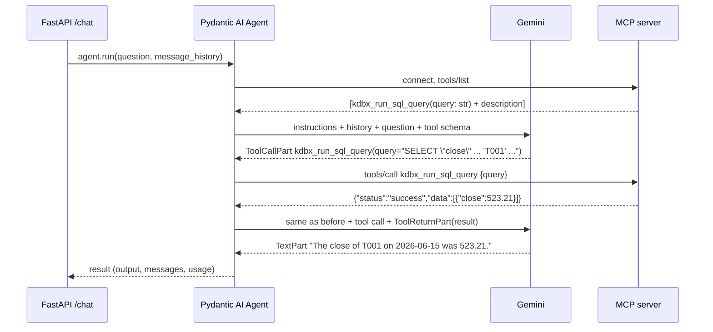

# 3. The agent: Pydantic AI + MCP

Code: `agent/kdb_agent.py` (about 150 lines).

## 1. The big idea: an LLM plus tools plus a loop

An LLM on its own only turns text into text. It can't see the database. An **agent** gives it **tools** and runs a loop:

```
while True:
    reply = llm(instructions, history, tool_descriptions)
    if reply is a tool call:              # "please run kdbx_run_sql_query(query=...)"
        result = run_the_tool(reply)      # our code runs it, not the LLM
        history += [reply, result]
    else:                                 # plain text: the final answer
        return reply
```

Three points:
1. **The LLM never runs anything.** It returns a structured request ("call tool X with arguments Y"), and our code runs it.
2. **The LLM knows a tool only from its description.** Before each call it receives each tool's name, its description, and a JSON schema for the arguments. It chooses tools based on that text.
3. **Memory is just the message list.** Each LLM call is stateless. A "conversation" means sending the earlier messages again every time.

**Pydantic AI** is a Python library that implements this loop: it talks to many LLM providers, describes tools to them, runs the tools and keeps the history. **MCP** ([doc 05](05-mcp-server.md)) is where our tools come from.

## 2. One question, step by step

Question: *"What was the close of T001 on 2026-06-15?"*



That's **2 LLM requests** for one question. Harder questions may need more, for example when a query fails, the LLM reads the error and tries again.

The message list after this run (simplified):

```
ModelRequest   (instructions="You answer questions…") [UserPromptPart("What was the close…")]
ModelResponse  [ToolCallPart(tool_name="kdbx_run_sql_query", args={"query": "SELECT …"})]
ModelRequest   [ToolReturnPart(content={"status":"success","data":[…]})]
ModelResponse  [TextPart("The close of T001 on 2026-06-15 was 523.21.")]
```

`ModelRequest` = what we sent; `ModelResponse` = what the LLM returned. A follow-up such as *"and T002?"* is sent with this whole list as history, and that's how the LLM knows "and T002" means "close on 2026-06-15".

## 3. Pydantic AI concepts used

| Concept | In our code | Meaning |
|---|---|---|
| `Agent(model, ...)` | `Agent(AGENT_MODEL, toolsets=[toolset], instructions=INSTRUCTIONS)` | The loop plus its configuration |
| Model string | `"google:gemini-3.1-flash-lite"` | `provider:model`. Switch to `"anthropic:claude-haiku-4-5"` and nothing else changes |
| Instructions | `INSTRUCTIONS` + `@agent.instructions def db_context()` | System-prompt text sent on every call. A decorated function is evaluated on each run, so its text can change at runtime |
| Toolset | `MCPToolset(MCP_URL)` | A group of tools. `MCPToolset` gets its tools from an MCP server |
| `agent.run(prompt, message_history=...)` | `/chat` | Runs the whole loop; returns `AgentRunResult` |
| `result.output` | answer text | The final `TextPart` |
| `result.all_messages()` / `new_messages()` | history / this turn only | Lists of `ModelRequest`/`ModelResponse` |
| `result.usage` | token log | `input_tokens`, `output_tokens`, `requests` |

## 4. The code, top to bottom

### Setup (lines 1–27)

```python
load_dotenv()                                    # read agent/.env into os.environ
AGENT_MODEL = os.getenv("AGENT_MODEL", "google:gemini-3.5-flash")
MCP_URL = os.getenv("MCP_URL", "http://127.0.0.1:8000/mcp")
```

`load_dotenv()` runs before the Pydantic AI imports, so `GOOGLE_API_KEY` is already set when the Google provider reads it.

### Instructions (lines 29–50)

`INSTRUCTIONS` holds the rules (always query, never calculate by hand, say when there's no data, refuse writes) plus **SQL dialect notes**. The notes exist because KX SQL lacks features the LLM would otherwise reach for, such as `LAG()`. This is plain prompt engineering: text that steers the model. Every SQL pattern in it was tested against kdb.

`FALLBACK_SCHEMA` is a hand-written table description, used only if the MCP resources can't be read at startup.

### The agent and its tools (lines 52–60)

```python
toolset = MCPToolset(MCP_URL)
agent = Agent(AGENT_MODEL, toolsets=[toolset], instructions=INSTRUCTIONS)
state = {"context": FALLBACK_SCHEMA}
sessions: dict[str, list[ModelMessage]] = {}     # session_id → message history (in memory)

@agent.instructions
def db_context() -> str:
    return state["context"]                      # appended to the instructions on every run
```

Note that **no tool is written in this file.** `MCPToolset` asks the MCP server which tools exist and turns each one into a Pydantic AI tool automatically. Add a tool to the MCP server and the agent can use it with no code change here.

### Startup: load schema and SQL guidance (lines 63–83)

```python
async def load_mcp_context():
    for res in await toolset.list_resources():           # MCP "resources" = read-only documents
        if res.name in ("kdbx_describe_tables", "kdbx_sql_query_guidance"):
            content = await toolset.read_resource(res.uri)
            ...
    state["context"] = "\n\n".join(parts)                # becomes part of the instructions

@asynccontextmanager
async def lifespan(_):                                   # FastAPI runs this once at startup
    async with toolset:                                  # open an MCP connection just for this
        await load_mcp_context()
    yield                                                # app serves requests from here on
```

MCP servers offer **tools** (actions the LLM can call) and **resources** (documents). We read two resources once and put them in the prompt: the table schema with sample rows, and KX's SQL guide. The LLM therefore knows the column names before it writes its first query.

### The chat endpoint (lines 112–138)

```python
@app.post("/chat")
async def chat(req: ChatRequest):
    for delay in (*RETRY_DELAYS, None):                  # (5, 10, None) → up to 3 attempts
        try:
            result = await agent.run(req.question,
                                     message_history=sessions.get(req.session_id))
            break
        except ModelHTTPError as e:                      # Gemini returned an HTTP error
            if e.status_code not in (429, 503) or "PerDay" in str(e.body) or delay is None:
                raise HTTPException(502, ...)            # not retryable → 502 to Tomcat
            await asyncio.sleep(delay)                   # rate limit / overload → wait, retry
        except Exception as e:
            raise HTTPException(502, ...)
    sessions[req.session_id] = result.all_messages()     # save history for the next turn
    sql = sql_from(result.new_messages())                # SQL actually run this turn
    log.info(json.dumps({...tokens, sql, duration...}))  # one structured log line per request
    return ChatResponse(answer=result.output, sql=sql, ...)
```

- **`agent.run(...)` is the whole loop from section 1.** It connects to the MCP server, calls Gemini, runs tools and repeats, then returns. Each run opens and closes its own MCP connection, so the agent keeps working if the MCP server restarts.
- **Retries:** 429 (rate limit) and 503 (overloaded) are temporary, so we retry twice. A daily quota doesn't reset in seconds, so we don't retry it. The total wait stays well under Tomcat's 90s timeout.
- **History** lives in a Python dict, so it's lost on restart. That's fine for Phase 1.

### Getting the SQL that was run (lines 102–109)

```python
def sql_from(messages):
    return [part.args_as_dict().get("query", "")
            for m in messages if isinstance(m, ModelResponse)
            for part in m.parts
            if isinstance(part, ToolCallPart) and part.tool_name == "kdbx_run_sql_query"]
```

The SQL comes from the **tool-call records**, not from the answer text. That's what was really sent to kdb, and it's what the UI shows under "Show SQL".

### Health (lines 141–149)

`/health` opens an MCP connection and reads the `kdbx://tables` resource. This goes all the way to kdb, so it fails if either the MCP server or kdb is down.

## 5. Who controls what

| Concern | Controlled by |
|---|---|
| Which SQL to write | The LLM, guided by the instructions, schema and guidance |
| Running the SQL | MCP server → kdb (the LLM only *asks*) |
| What SQL is allowed | kdb (`init.q`): read-only, enforced in the database |
| The numbers in the answer | kdb results. The LLM is told to copy them, not compute them |
| Conversation memory | Our `sessions` dict |
| Which LLM | `AGENT_MODEL` in `agent/.env` |

## 6. Try it

```bash
curl -s 127.0.0.1:8001/health
curl -s 127.0.0.1:8001/chat -H 'content-type: application/json' \
  -d '{"session_id":"s1","user_id":"me","question":"What was the close of T001 on 2026-06-15?"}'
curl -s 127.0.0.1:8001/chat -H 'content-type: application/json' \
  -d '{"session_id":"s1","user_id":"me","question":"and T002?"}'      # same session → uses history
```

The agent log line for each request shows the SQL, the token counts and the number of LLM requests.

Tests: `agent/tests/test_e2e.py` asks the test questions from the plan (section 6) against a running agent and compares the answers with `make kdb-expected`. They call the real LLM, so mind the free-tier quota (about 20 requests per day per model).
