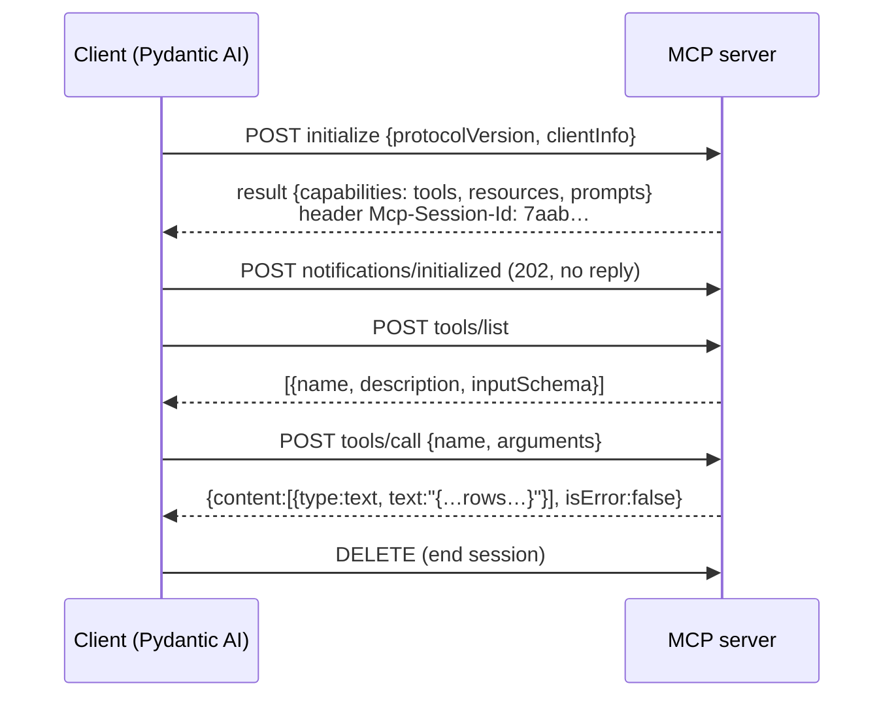
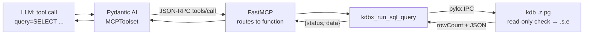

# 4. MCP and the KDB-X MCP server

Code: `mcp-server/kdb-x-mcp-server/` (KX's open-source repo, git submodule pinned to `9c9debc`, not modified).

## 1. The big idea: a standard plug between agents and systems

Without a standard, every agent needs custom code for every database or API. **MCP (Model Context Protocol)** is an open standard that fixes this: a system is wrapped once as an **MCP server**, and any MCP-capable agent (Claude, Pydantic AI, IDEs…) can use it.

```
      many agents                          many systems
 Pydantic AI ─┐                      ┌─ MCP server ── kdb
 Claude app ──┼──── MCP protocol ────┼─ MCP server ── GitHub
 IDE ─────────┘                      └─ MCP server ── files
```

An MCP server offers three kinds of things:

| Kind | What it is | Who uses it | KDB-X server provides |
|---|---|---|---|
| **Tools** | Functions with typed arguments. Can do things | The **LLM** decides to call them | `kdbx_run_sql_query(query)` |
| **Resources** | Read-only documents at a URI | The **app** reads them (we add them to the prompt) | `kdbx://tables`, `file://guidance/kdbx-sql-queries` |
| **Prompts** | Prompt templates with parameters | The **user** picks them, e.g. from a menu | `kdbx_table_analysis` (unused here) |

## 2. The protocol

MCP is **JSON-RPC 2.0** (request = `{"jsonrpc":"2.0","id":1,"method":...,"params":...}`, response = `{"id":1,"result":...}`). Our server uses the **streamable HTTP** transport: everything is `POST`ed to one URL, e.g. `http://127.0.0.1:8101/mcp` (the prices role's server). Replies come back as JSON or as a short server-sent-events stream (`event: message` / `data: {...}`).

A session, captured with curl from this server:



Real messages:

```jsonc
// tools/list → the LLM is shown exactly this (name + description + schema)
{"name": "kdbx_run_sql_query",
 "description": "Execute a SQL query and return structured results ...",
 "inputSchema": {"type": "object", "properties": {"query": {"type": "string"}}, "required": ["query"]}}

// tools/call request
{"method": "tools/call",
 "params": {"name": "kdbx_run_sql_query",
            "arguments": {"query": "SELECT \"sym\",\"close\" FROM daily_prices LIMIT 2"}}}

// tools/call result
{"content": [{"type": "text",
              "text": "{\"status\": \"success\", \"data\": [{\"sym\": \"T001\", \"close\": 389.36}, ...]}"}],
 "isError": false}
```

Pydantic AI's `MCPToolset` does all of this for you. When the LLM asks to call the tool, it sends `tools/call` and passes the result back to the LLM.

## 3. FastMCP: writing a server in plain Python

**FastMCP** (part of the official `mcp` Python SDK) turns decorated Python functions into MCP endpoints. It reads the **function signature** to build the JSON schema, and the **docstring** to build the description:

```python
from mcp.server.fastmcp import FastMCP
mcp = FastMCP("demo")

@mcp.tool()
async def add(a: int, b: int) -> int:
    """Add two numbers."""                         # → description the LLM reads
    return a + b                                   # → {"a": int, "b": int} inputSchema

@mcp.resource("demo://readme")
async def readme() -> str:
    return "hello"

mcp.run(transport="streamable-http")               # serves POST /mcp
```

So **the docstring is part of the prompt**: it's how the LLM learns what the tool does.

## 4. How the KDB-X server is built

```
src/mcp_server/
├── __init__.py, main.py        entry point: `uv run mcp-server` → server.main()
├── server.py                   McpServer: FastMCP + startup checks + registration
├── settings.py                 config from env vars (KDBX_MCP_*, KDBX_DB_*) via pydantic-settings
├── utils/kdbx.py               pykx connection to kdb (cached, reconnects)
├── tools/
│   ├── __init__.py             auto-discovers every module in tools/ (files starting with _ are skipped)
│   ├── kdbx_run_sql_query.py   ← the tool we use
│   └── kdbx_sim_search.py      vector search tools (disabled: needs KDB-X AI libs)
├── resources/
│   ├── kdbx_database_tables.py     kdbx://tables
│   ├── kdbx_sql_query_guidance.py  file://guidance/kdbx-sql-queries (reads the .txt next to it)
│   └── kdbx_sql_query_guidance.txt
└── prompts/kdbx_table_analysis.py
```

### Startup (`server.py`)

```python
self.mcp = FastMCP(name, host="127.0.0.1", port=KDBX_MCP_PORT)   # 8101 / 8102 / 8103 per role
self._check_port_availability()   # fail early if the port is taken
self._check_kdb_connection()      # connect via pykx; check version, SQL loaded (.s), AI libs (.ai)
self._register_tools()            # tools/__init__.py imports each module and calls its register_tools(mcp)
self._register_prompts()
self._register_resources()
self.mcp.run(transport="streamable-http")
```

The **plugin pattern**: each file in `tools/` exports `register_tools(mcp)`, which applies `@mcp.tool()` to its functions. To add a tool, you drop a new file in that folder. The search tools return nothing when the AI libs are missing, which is why only `kdbx_run_sql_query` appears.

### The SQL tool (`tools/kdbx_run_sql_query.py`)

```python
@mcp_server.tool()
async def kdbx_run_sql_query(query: str) -> Dict[str, Any]:
    """Execute a SQL query ... Use the kdbx_sql_query_guidance resource ..."""
    # 1. weak keyword check in Python (INSERT, DROP, …)
    # 2. send to kdb as ONE q call: a q function + the SQL string + a row limit
    result = conn('{r:.s.e x;`rowCount`data!(count r;.j.j y sublist r)}',
                  kx.CharVector(query), 1000)
    #   .s.e x        → run the SQL (x) in kdb
    #   y sublist r   → keep at most 1000 rows (y)
    #   .j.j          → serialize to JSON inside kdb
    # 3. return {"status": "success", "data": rows} or {"status": "error", "message": ...}
```

The work happens in kdb: the server sends one q expression, and kdb runs the SQL, trims the rows and returns JSON. The Python side only passes the request through.

This exact q string is also what `kdb/init.q` recognizes (`.sec.sqlCall`) to send the call through the read-only SQL check. **The real protection is in kdb.** The Python keyword check is easy to get around.

### The resources

- `kdbx://tables`: for each table, `meta` (schema) plus the row count plus 3 sample rows, formatted as text.
- `file://guidance/kdbx-sql-queries`: a static text file with KX's SQL rules, for example "quote column names".

### Connection and config

- `utils/kdbx.py`: one cached `pykx.SyncQConnection`. If kdb dropped the connection, it reconnects on the next call.
- `settings.py`: every value comes from env vars, so we configure each instance with `mcp-server/.env.<role>` (loaded by `mcp-server/run.sh <role>`) and leave its code untouched. Built-in defaults (we override the ports per role): kdb `127.0.0.1:5000`, MCP `127.0.0.1:8000`, transport `streamable-http`.

## 5. One server per role

The server holds **one** kdb login from its env vars, and different roles can't share it. So we run the same unmodified code three times, with different config:

```
mcp-server/run.sh prices  → .env.prices: KDBX_MCP_PORT=8101, KDBX_DB_PORT=5001, KDBX_DB_USERNAME=ro_prices
mcp-server/run.sh trades  → .env.trades: KDBX_MCP_PORT=8102, KDBX_DB_PORT=5002, KDBX_DB_USERNAME=ro_trades
mcp-server/run.sh quotes  → .env.quotes: KDBX_MCP_PORT=8103, KDBX_DB_PORT=5003, KDBX_DB_USERNAME=ro_quotes
```

`make mcp` starts all three in the background (logs: `mcp-server/mcp-<role>.log`), and `make mcp-stop` stops them. Each server describes and queries only the table its kdb process has loaded, so `kdbx://tables` on :8102 shows only `trades`. The MCP server isn't the security boundary; kdb is. See [06-roles.md](06-roles.md).

## 6. The whole path of one tool call



## 7. Poke it yourself

```bash
make mcp-check ROLE=trades     # MCP Inspector CLI: tools/list + the schema resource

# raw protocol with curl
U=http://127.0.0.1:8101/mcp     # prices role (8102 trades, 8103 quotes)
H=(-H 'Content-Type: application/json' -H 'Accept: application/json, text/event-stream')
SID=$(curl -s -D - "${H[@]}" $U -d '{"jsonrpc":"2.0","id":1,"method":"initialize","params":{"protocolVersion":"2025-06-18","capabilities":{},"clientInfo":{"name":"curl","version":"1"}}}' \
      | grep -i mcp-session-id | awk '{print $2}' | tr -d '\r')
curl -s "${H[@]}" -H "Mcp-Session-Id: $SID" $U -d '{"jsonrpc":"2.0","method":"notifications/initialized"}'
curl -s "${H[@]}" -H "Mcp-Session-Id: $SID" $U -d '{"jsonrpc":"2.0","id":2,"method":"tools/list"}'
curl -s "${H[@]}" -H "Mcp-Session-Id: $SID" $U \
  -d '{"jsonrpc":"2.0","id":3,"method":"tools/call","params":{"name":"kdbx_run_sql_query","arguments":{"query":"SELECT \"sym\",\"close\" FROM daily_prices LIMIT 2"}}}'
```

For a GUI, run `npx @modelcontextprotocol/inspector` and connect to `http://127.0.0.1:8101/mcp` (transport: Streamable HTTP).
