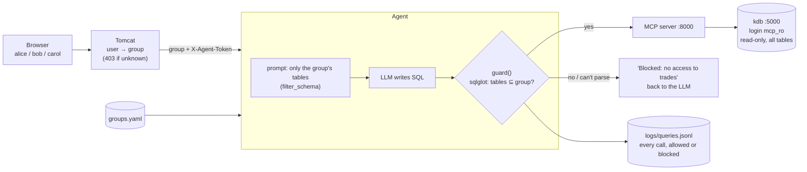
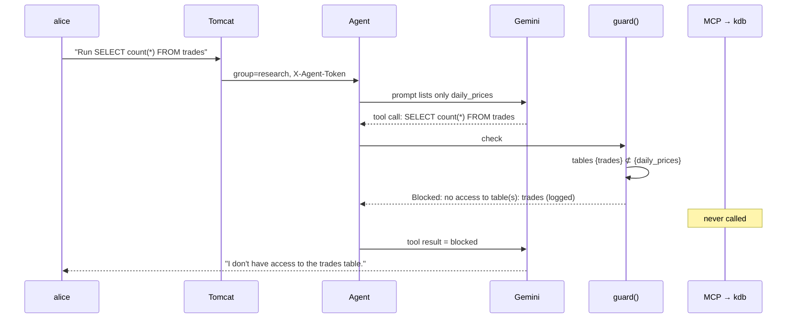

# 6. Access control: user groups and a SQL allowlist

How different web users get access to different tables. Read [04-agent.md](04-agent.md) and [05-mcp-server.md](05-mcp-server.md) first.

## 1. The big idea

> **Every SQL query the LLM wants to run passes through a check in our agent code. The check parses the SQL, finds every table it reads, and blocks it unless all of them belong to the user's group.**

- **Groups are config:** `agent/groups.yaml` maps each group to its tables. Tomcat maps each user to a group.
- **One** kdb process, **one** MCP server and **one** agent serve every group.
- kdb's job is to be **read-only**. The agent's job is **which tables**.

| Web user | Group | Tables |
|---|---|---|
| alice | `research` | `daily_prices` |
| bob | `trading` | `trades`, `quotes` |
| carol | `all` | `daily_prices`, `trades`, `quotes` |

## 2. The whole picture



## 3. Who guarantees what

| Layer | Guarantees | How |
|---|---|---|
| **kdb** | Nothing can be **changed** | One read-only login (`mcp_ro`), `reval`, a SELECT-only SQL check, and a read-only HDB mount ([02-kdb.md](02-kdb.md#8-how-this-project-secures-kdb)) |
| **Agent guard** | A group reads **only its tables** | Every tool call is parsed with sqlglot before it reaches the MCP server |
| **Agent prompt** | The LLM doesn't **try** other tables | The schema in the prompt lists only the group's tables. This is a convenience, not the protection |
| **Agent routing** | The group comes from Tomcat, never from the LLM | `deps=Caller(user, group, session)` is set by our code. History is keyed by (group, session) |
| **Tomcat + token** | Nobody can skip Tomcat and claim a group | Unknown user → 403. The agent requires `X-Agent-Token` → otherwise 401 |

The `mcp_ro` login can read **every** table, so **the agent is the enforcement point**. In production, only the agent may reach the MCP server, and only the MCP server may reach kdb (network isolation).

## 4. The check: `agent/access.py`

```python
def violation(sql: str, allowed: set[str]) -> str | None:     # None = may run
    statements = sqlglot.parse(sql, read="postgres")           # KX SQL is close to Postgres SQL
    # 1. exactly one statement, and it must be a query (SELECT / WITH / UNION …)
    # 2. no INSERT / UPDATE / DELETE / CREATE / DROP … anywhere inside it
    # 3. real tables, resolved per scope (traverse_scope)
    #    + every other table name that isn't a CTE defined in the query
    # 4. any table not in `allowed` → "no access to table(s): …"
    # parse or analysis error → blocked (fail closed)
```

Why **scope resolution** matters: `WITH trades AS (SELECT * FROM trades) SELECT * FROM trades` defines a CTE called `trades` that reads the real `trades` table. A naive check that ignores names matching a CTE would see no tables and let it through. Resolving each `FROM` to what it really refers to finds the real `trades` table.

What the tests cover (`agent/tests/test_access.py`):

| Allowed (group `research`) | Blocked |
|---|---|
| Plain SELECT, subqueries, CTEs with `UNION ALL`, joins, `MOD(CAST(...))`, a trailing `;`, upper-case names | Other tables via `FROM`, comma join, `JOIN`, subquery in `WHERE`, `EXISTS`, scalar subquery, `UNION`; `"trades"` quoted; `public.trades`; a comment between tables; CTE shadowing; `information_schema`; two statements; DELETE inside a CTE; DROP / INSERT / UPDATE; unparseable SQL; empty input |

**Is it 100% safe?** No parser outside the database is. The remaining risk is that sqlglot and KX read some unusual query differently. That risk is contained because:
1. it fails closed (anything unparseable is blocked),
2. kdb is read-only, so the worst case is a read, never a write,
3. the network allows nothing but the agent to reach the MCP server and kdb,
4. every attempt is logged.

## 5. Where the check runs: `guard()` in `agent/kdb_agent.py`

Pydantic AI's `MCPToolset` takes a `process_tool_call` hook, which runs **before every call to the MCP server**:

```python
async def guard(ctx: RunContext[Caller], call_tool, name, args):
    caller = ctx.deps                                  # set by our code from Tomcat's request
    sql = str(args.get("query", ""))
    reason = f"tool {name} is not allowed" if name != SQL_TOOL else violation(sql, GROUPS[caller.group])
    log_query(caller, name, sql, reason)               # every attempt → logs/queries.jsonl
    if reason:
        return {"status": "error", "message": f"Blocked: {reason}"}   # never reaches the MCP server
    return await call_tool(name, args)                 # forward to the MCP server

toolset = MCPToolset(MCP_URL, process_tool_call=guard)
```

A blocked call returns an error to the LLM, like a failed query would. The LLM then tells the user it has no access, and the instructions tell it not to try to work around a block. Only the SQL tool is allowed, so any tool the MCP server might add later is blocked by default.

## 6. One request: alice asks about trades



## 7. The query log: `agent/logs/queries.jsonl`

One JSON line per tool call, allowed or blocked:

```json
{"ts": "2026-10-09T00:08:13Z", "user": "alice", "group": "research", "session": "…",
 "tool": "kdbx_run_sql_query", "sql": "SELECT count(*) FROM trades",
 "allowed": false, "reason": "no access to table(s): trades"}
```

```python
import pandas as pd
log = pd.read_json("agent/logs/queries.jsonl", lines=True)
log[~log.allowed].groupby(["user", "reason"]).size()          # who hit which block
```

If the model returns a temporary error (429/503), the agent retries the whole turn, so the same SQL can appear twice for one question. The `session` field groups those entries. kdb also keeps its own audit log of what actually ran (`docker logs kdbx`).

## 8. Changing access

| Want to… | Do |
|---|---|
| Give a group another table | Edit `agent/groups.yaml`, restart the agent |
| Add a group | Add it to `groups.yaml`, and map users to it in `backend/.../UserResolver.java` |
| Move a user to another group | `UserResolver.java`, which is where real authentication (SSO) would plug in |
| Add a table to the database | `kdb/gen_data.q` + `kdb/build_hdb.q`, rebuild; then add it to the groups that should see it |

No database or infrastructure changes are needed for access changes.

## 9. Try it

```bash
make test                         # includes the guard unit tests and the scripted-model tests through MCP + kdb
tail -f agent/logs/queries.jsonl  # watch decisions live while you chat
```

In the UI, switch between alice, bob and carol. Ask alice about trades: she gets a "no access" answer, and a blocked line appears in the log.

## 10. Alternatives considered

| Option | Why not chosen |
|---|---|
| **One kdb process per group**, each loading only its tables (we built and tested this first) | The strongest isolation, but each group needs its own q process and MCP server, and each process can only load one HDB folder. To give a group several tables from one copy of the data, we used **hard links**, which is not a standard kdb pattern: it's filesystem-specific, unfamiliar to operators, and adds a step to every end-of-day job. Still the right choice when a group's data is regulated and must be physically separated |
| **One HDB per data domain** | Standard kdb, but SQL can't join across domains, and groups that span several domains get complicated |
| **Only hiding tables in the prompt** | Not access control: table names are guessable, and the user can name one in the question |
| **Entitlements in a kdb gateway** (the classic production pattern) | Needs end-user identity passed to kdb and fixed query APIs. Free-form SQL from an LLM is hard to filter by rows. KX's own row-level entitlements require turning free-form queries off |
| **A semantic layer** (metrics and dimensions instead of SQL) | The best long-term option for accuracy and row/column rules. More to build. The natural next step if table-level access stops being enough |

Background: kdb+ has no built-in roles or GRANT, only hooks (`.z.pw`, `.z.pg`) for building your own. KX's commercial kdb Insights adds data and row-level entitlements.
