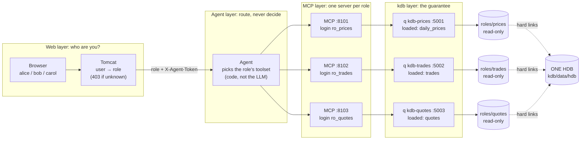
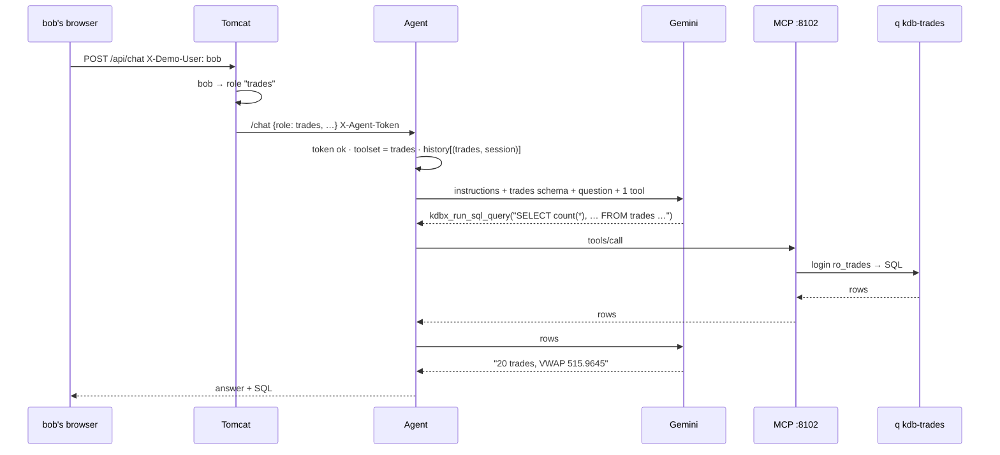

# 6. Role-based, read-only access

How different web users get different data, safely. Read [02-kdb.md](02-kdb.md) and [05-mcp-server.md](05-mcp-server.md) first.

## 1. The big idea

> **A role can only see what its q process has loaded. So we give each role its own q process, which loads only that role's table.**

The rules are enforced by **what exists**, not by checking queries. `trades` isn't hidden from alice's process; it was never loaded there, and the files aren't even mounted in her container. Every layer above kdb only **routes** a user to the right process.

| Web user | Role | Sees | kdb process (q) | kdb user | MCP server |
|---|---|---|---|---|---|
| alice | `prices` | `daily_prices` | `kdb-prices` :5001 | `ro_prices` | :8101 |
| bob | `trades` | `trades` | `kdb-trades` :5002 | `ro_trades` | :8102 |
| carol | `quotes` | `quotes` | `kdb-quotes` :5003 | `ro_quotes` | :8103 |

## 2. The whole picture



## 3. One database, three views: the storage trick

There is **one** database on disk. Each role gets a **view folder** that contains only its own table's files, as **hard links**: a second name for the same file, so no data is copied (`du` shows 73 MB in total, not 146 MB).

```
kdb/data/
├── hdb/                                ← THE database (written once by make kdb-hdb)
│   ├── daily_prices_sym  trades_sym  quotes_sym      ← one symbol file per table
│   └── 2026.09.30/
│       ├── daily_prices/  .d sym name close volume
│       ├── trades/        .d sym time price size
│       └── quotes/        .d sym time bid ask bsize asize
└── roles/
    ├── prices/                         ← mounted at /db in kdb-prices ONLY
    │   ├── daily_prices_sym            (hard link)
    │   └── 2026.09.30/daily_prices/…   (hard links)
    ├── trades/                         ← mounted at /db in kdb-trades ONLY
    │   ├── trades_sym
    │   └── 2026.09.30/trades/…
    └── quotes/ …
```

Why each table has its own symbol file (`.Q.dpfts`, not `.Q.dpft`): symbol columns are stored as integers that point into a symbol file. If all tables shared one `sym` file, every role would need it, and it would contain, for example, company names from `daily_prices`. With one file per table, each view is fully self-contained.

When `kdb-prices` starts, `\l /db` finds date folders that contain only `daily_prices`, so that's the only table that exists in that process.

## 4. Five layers of protection

From the bottom up. **The first three are the guarantee; the top two route requests correctly.**

| # | Layer | What stops alice reading `trades` or changing data |
|---|---|---|
| 1 | **Mount** | `kdb-prices` only has `data/roles/prices` mounted, read-only. The `trades` files aren't in her container at all. |
| 2 | **q process** | `tables[]` is just `daily_prices`. `SELECT … FROM trades` fails with `can't lookup trades`. |
| 3 | **kdb login** | `.z.pw` accepts only `ro_prices` on this process. Bob's real password is rejected here. Queries run read-only: `reval` or the SELECT-only SQL check ([02-kdb.md](02-kdb.md#8-how-this-project-secures-kdb)). |
| 4 | **Agent** | The toolset is picked **by code** from the role Tomcat sent. The LLM never sees the other roles' tools, so prompt injection can't switch roles. History is keyed by (role, session), so it never mixes. |
| 5 | **Tomcat + token** | Tomcat maps the user to a role (unknown user → 403). The agent accepts `/chat` only with the shared `X-Agent-Token`, so nobody can skip Tomcat and claim a role. |

Even if layers 4 and 5 were bypassed, layers 1–3 would still hold: the worst case is a request reaching the wrong role's process, which can still read only that role's table.

## 5. One request: bob asks about trades



If alice asks the same thing, her request goes to MCP :8101 → `kdb-prices`, where `trades` doesn't exist. The model reports that it has no access.

## 6. The code, piece by piece

| Piece | File | Key lines |
|---|---|---|
| Build views | `kdb/build_hdb.q` | `.Q.dpfts[db;d;`sym;t;`<table>_sym]` per table; then `cp -al` (hard links) of one table into `roles/<role>/` |
| Role process | `kdb/docker-compose.yml` | Three services from one template; each mounts `./data/roles/<role>:/db:ro` and sets `KDB_ROLE_USER` |
| Only this role's user | `kdb/init.q` | `.z.pw` rejects any user other than `KDB_ROLE_USER` |
| Credentials | `kdb/mkuser.sh <role>` | Adds `ro_<role>` to `users.txt` and writes `mcp-server/.env.<role>` (ports, user, password) |
| MCP per role | `mcp-server/run.sh <role>` | Loads `.env.<role>` and runs the unmodified KX server |
| Agent routing | `agent/kdb_agent.py` | `toolsets = {role: MCPToolset(url)}`; `agent.run(..., deps=role, toolsets=[toolsets[role]])`; `@agent.instructions` returns that role's schema |
| Agent auth | `agent/kdb_agent.py` | `secrets.compare_digest(x_agent_token, AGENT_TOKEN)` → else 401; unknown role → 403 |
| User → role | `backend/.../UserResolver.java` | `Map.of("alice","prices","bob","trades","carol","quotes")`, unknown → 403. **This is where real login (SSO) would replace the demo header.** |

## 7. See it for yourself

```bash
make kdb-test                 # per role: own table only, other roles' logins rejected, writes blocked
make test                     # + MCP/agent/Tomcat isolation (no LLM)

docker exec kdb-prices ls /db/2026.09.30          # → daily_prices   (trades isn't even there)
ls -li kdb/data/hdb/2026.09.30/trades/price kdb/data/roles/trades/2026.09.30/trades/price   # same inode

make mcp-check ROLE=trades    # MCP schema resource shows only `trades`
docker logs kdb-prices | grep trades              # audit log: who sent what, and it failed
```

In the UI, switch the user to alice, bob or carol. Each starts a new conversation and can only answer about their own data.

## 8. Design choices and limits

- **Why not one q process with a per-user table allowlist?** That requires knowing which tables any q expression touches, which is hard to do reliably. With separate processes, the question doesn't arise.
- **Cost:** one q process and one MCP server per role. For many roles you'd generate them from a config file, which the compose template and `mkuser.sh` are already set up for.
- **Row or column rules** (e.g. role sees T001–T050, or no `volume`): build that role's view with only those columns or rows, in the same hard-link or view folder way, or add per-role q views.
- **Still a demo:** user → role comes from a trusted header (`X-Demo-User`). Production needs real authentication in `UserResolver` and network isolation, so that only the agent can reach the MCP servers and only the MCP servers can reach kdb.
